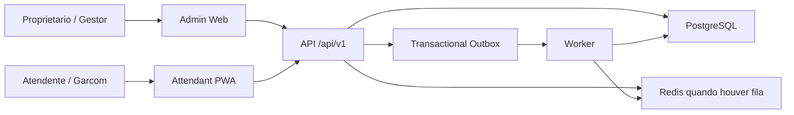

# Contexto do Sistema

AdegaOS sera iniciado como monolito modular em monorepo. A API e a autoridade de regras financeiras, estoque, permissao e consistencia. Os frontends consomem contratos versionados e nao recalculam valores consolidados.

## Containers Logicos

- `apps/api`: API NestJS modular, contratos REST, autenticacao, autorizacao, transacoes e orquestracao.
- `apps/admin-web`: painel administrativo para gestao, financeiro, estoque, relatorios e configuracoes.
- `apps/attendant-pwa`: webapp mobile-first para atendimento rapido e operacao offline limitada.
- `apps/worker`: processamento assincrono de jobs, outbox e tarefas agendadas.
- `packages/domain`: regras puras, value objects, eventos e contratos de dominio.
- `packages/database`: Prisma schema, migrations, seeds e adaptadores de persistencia.
- `packages/api-client`: cliente tipado para frontends.
- `packages/ui`: design system compartilhado.
- `packages/auth`: contratos e helpers de autenticacao/autorizacao.
- `packages/observability`: correlation id, logs, metricas e tracing.
- `packages/testing`: factories, fixtures e utilitarios de testes.
- `packages/config`: configuracoes compartilhadas de ambiente e tooling.

## Fronteiras Criticas

- Dinheiro, estoque, CMV e financeiro ficam no backend.
- A PWA pode persistir comandos locais, mas confirmacao definitiva depende da API.
- Worker nao executa a parte critica da finalizacao de venda fora da transacao principal.
- Eventos duraveis devem usar outbox quando precisarem sobreviver a falhas.
